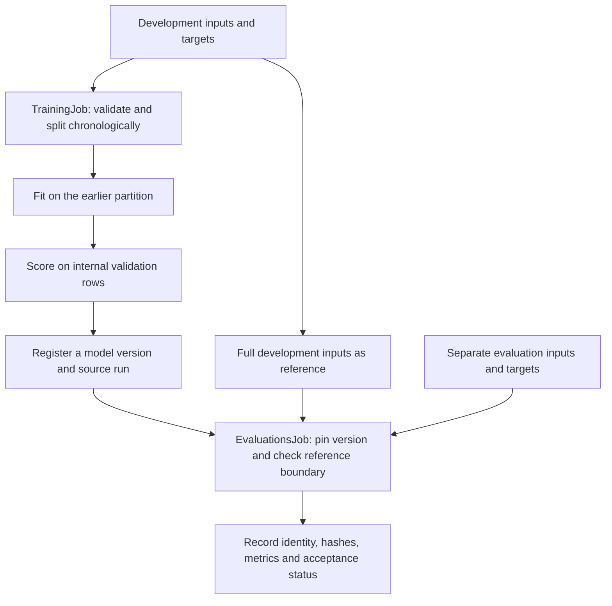
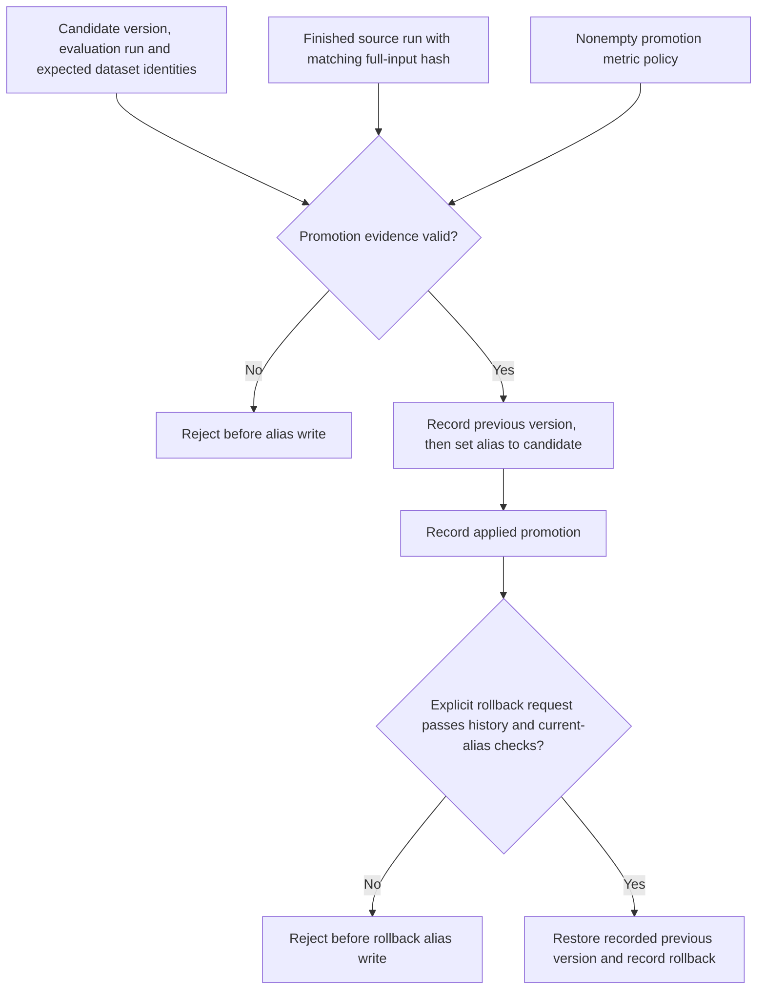

# MLOps Python Package

[](https://github.com/DiogoRibeiro7/mlops-python-package/actions/workflows/check.yml)

**This is a derivative project, originally forked from [fmind/mlops-python-package](https://github.com/fmind/mlops-python-package), authored by Médéric HURIER and upstream contributors.** Its original architecture, bike example and most of its current implementation were inherited. Detaching the GitHub fork does not change that provenance.

Diogo Ribeiro maintains this independent continuation. Our aim is to improve reproducibility, scientific validation and model-promotion controls while giving the original work clear credit.

The development goal is reproducible training and auditable model promotion. The inherited implementation is a starting point and is not yet a validated production system.

## What has changed here

The independent work so far establishes maintenance ownership, removes automatic upstream synchronization, corrects repository and publishing links, and documents the inherited limitations. Runtime environment exports now come from the uv lockfile with a CI freshness check and preserved platform markers. A separate Linux/Python 3.13 job builds the wheel, installs it in a clean runtime environment, checks dependency consistency, and verifies package origin, CLI help/schema output and training, reload, evaluation and promotion outside the checkout.

The bike model now excludes the target components `casual` and `registered`. Input validation removes those legacy columns before training, inference, explanations and signature generation; they are no longer required. Regression tests check that changing them cannot change a newly trained model’s predictions. Integration tests also reload a registered custom model and send the training job’s persisted example through MLflow’s JSON scoring parser in split and records formats, without source row IDs. Training, tuning and evaluation now reject empty, duplicate or misaligned row IDs. Package splitters require unique, increasing calendar hours derived from `dteday` and `hr`, and reject shuffling. Direct model fitting and metric scoring also enforce row alignment. The example evaluation now uses the separate test files and checks their IDs and calendar boundary against the declared development inputs. Evaluation resolves the requested alias or version once, loads a version URI, and records the registered name, version, URI, requested selector and source run ID in MLflow tags. Promotion now requires an explicit candidate, a completed matching evaluation, declared dataset digests, full-table SHA-256 fingerprints and passing metrics under its own policy. The reference fingerprint must match the source run’s recorded full development inputs. Verifying actual execution history remains open work. The [roadmap](documentation/ROADMAP.md) defines their acceptance criteria, and [ATTRIBUTION.md](ATTRIBUTION.md) records the starting point.

## Inherited capabilities

- Typed configuration with Pydantic and dataframe validation with Pandera.
- Separate modules for models, data access, registries and execution jobs.
- MLflow experiment tracking, dataset logging and model registration.
- Training, time-series cross-validation, batch inference, evaluation and SHAP explanations.
- Python 3.13, uv, pytest, Ruff, mypy and Bandit.

The package and command remain named `bikes` for compatibility. Version `4.1.0` is inherited and does not represent a new independent release.

## Workflow at a glance

This diagram shows the current training and reference-checked evaluation path. The full development table includes the internal validation rows, so the evaluation boundary is checked against more than just the fitting partition.



Tuning is a separate job that uses chronological cross-validation. `just project` runs tuning and training, then stops. Evaluation and promotion require deliberate follow-up commands. The separate evaluation files are not claimed to be an untouched final test set.

## Development setup

Install Python 3.13 and uv 0.11.33 (the version pinned in CI), then run:

```bash
git clone https://github.com/DiogoRibeiro7/mlops-python-package.git
cd mlops-python-package
uv sync --locked --all-groups
uv run bikes --help
uv run bikes --schema
```

Run the same core checks used by CI:

```bash
uv run ruff check --no-fix src tests
uv run ruff format --check src tests
uv run mypy src tests
uv run bandit --recursive --configfile=pyproject.toml src
uv run pytest -n auto --cov=src --cov-fail-under=80 tests
```

Use `uv.lock` as the dependency source of truth. Regenerate and verify runtime exports with:

```bash
python scripts/export_environment.py
python scripts/export_environment.py --check
```

Both exports exclude default development groups and retain platform conditions. This aligns them with the existing MLflow 2.20.3 baseline; it is not a dependency security upgrade. The pending dependency update requires a separate compatibility review. The wheel smoke check covers imports, CLI startup, training, registration, model reload, evaluation and promotion on Linux/Python 3.13. It does not establish model quality, rollback job execution, other operating systems or container correctness. Container validation remains open.

## Structure

| Path | Responsibility |
| --- | --- |
| `src/bikes/core/` | Models, metrics and dataframe schemas |
| `src/bikes/io/` | Configuration, datasets, MLflow services and registry adapters |
| `src/bikes/jobs/` | Training, tuning, promotion, inference, evaluation and explanations |
| `src/bikes/utils/` | Splitters, hyperparameter search and model signatures |
| `confs/` | Example job configurations |
| `tests/` | Unit and integration tests with sample data |
| `scripts/` | Runtime environment export and verification |
| `documentation/` | Maintained project documentation and roadmap |

### Installed workflow check

The installed-wheel CI job also runs a small training job outside the checkout using only locked runtime dependencies. It uses the first 1,500 development rows, reserves the last 168 for internal validation, registers the resulting model in a temporary local MLflow store, reloads its explicit version and checks prediction equality and recorded data fingerprints. It then evaluates the registered version on the next 168 development rows, using the original 1,500 inputs as the reference. A deliberately wrong input hash must reject promotion without changing aliases; the matching evidence must then promote the selected version and record its audit. All generated data and tracking files are temporary.

The evaluation and promotion smoke checks use an explicit permissive MSE bound of 10¹² to test execution and evidence handling. They do not read the final-test files. This checks packaging, model persistence and the promotion contract. It does not establish model quality, an untouched final test set, HTTP serving or container execution. The production evaluation and promotion thresholds remain unchanged.

## Evaluation and promotion

`just project` now stops after tuning and training. Select the registered candidate version deliberately, then evaluate it using the declared development reference and separate evaluation files. For example, if the candidate is version 1:

```bash
uv run bikes confs/evaluations.yaml -e '{"job":{"alias_or_version":1}}'
```

The default R² threshold remains 0.5. A run that fails this threshold is rejected; do not lower the production policy merely to complete the example.

Before promotion, fill the required fields in `confs/promotion.yaml`: the candidate version, its evaluation run ID, and both `dataset_digests` (MLflow lineage) and `dataset_sha256` (full-table SHA-256) for `inputs`, `targets` and `reference_inputs`. Compute the expected hashes with `bikes.io.provenance.fingerprint` after applying the corresponding input/target schema validation. Review the dataset identities against the intended evaluation files. The `???` placeholders deliberately prevent an unconfigured promotion. Then run:

```bash
uv run bikes confs/promotion.yaml
```

Promotion requires an active, finished evaluation in the configured experiment. Its recorded model name, version, URI and nonempty source run ID must match the candidate. Both the threshold and reference-boundary checks must have passed, and each expected dataset identity must match exactly one lineage entry. Promotion independently rechecks finite metrics against its own nonempty threshold policy, which defaults to R² ≥ 0.5. Diagnostic or historical runs without this evidence are rejected before any alias write.

All three evaluation hashes must use `bikes.dataframe.v1` and match the configured values. The candidate’s source run must also be active and finished in the configured experiment, with its full `data.inputs.sha256` matching the evaluation reference. Training records this full development table before fitting its internal split. Historical models missing these records require a new training run; do not backfill tags to make them eligible.

A promotion run records the candidate, evaluation run ID, expected digests and hashes, promotion policy and previous alias version (empty if unset). Its status becomes `applied` after the registry write.

To restore a previous alias version, fill `confs/rollback.yaml` with the successful promotion run ID, the version expected to be current, the explicit target version and a reason, then run:

```bash
uv run bikes confs/rollback.yaml
```

`RollbackJob` checks the promotion’s experiment, completion status, registered model and alias. The target must match its recorded previous version and still exist. The alias must still point to the version installed by that promotion. Stale records, repeated attempts after restoration and promotions with no previous alias are rejected. Rollback records its source promotion, reason, from/to versions and applied status in a separate tracking run. It restores registry routing and does not re-evaluate the old model or establish that it meets the current promotion policy.

This gate trusts the MLflow tracking and registry stores. Their records are mutable, MLflow lineage digests are not cryptographic full-data hashes, and the declared reference still does not prove the model’s training history. Concurrent alias changes are not serialized, and the alias write and tracking audit are not one transaction. If a run fails after the write, inspect the registry before retrying. These limits remain release blockers in the roadmap.

### Promotion and rollback decisions

Promotion checks both the chosen evidence and its own metric policy before changing an alias. Rollback uses the recorded previous version and checks that the alias still points to the version installed by that promotion.



The promotion decision includes model identity, run status and experiment, passed evaluation checks, lineage digests, versioned full-table hashes and finite metrics. The arrows show job order, not an atomic transaction: alias writes and audit updates can fail separately, and concurrent writers are not serialized. Rollback does not re-evaluate the restored model. Hash matching checks mutable records and does not prove actual training history.

## Full-table fingerprints

Training, tuning and evaluation now record SHA-256 fingerprints of every validated row, including row IDs, ordered columns and dtypes. Training also records its fitting and internal validation partitions; evaluation records a supplied reference after its boundary check succeeds. Each role has `data.<role>.sha256` and `data.<role>.format` tags plus a `provenance/<role>.json` metadata artifact.

These fingerprints describe the model-ready tables after schema conversion, including Float16 weather values and removal of legacy target components. They are separate from source-file hashes and MLflow’s lineage digests. Promotion requires both kinds of identity and matches the reference fingerprint against the source run’s recorded full inputs. This is a consistency check on stored metadata, not proof of actual training execution. See the [encoding contract and limitations](documentation/DATA_FINGERPRINTS.md).

## Known limitations

The model estimates hourly rental count (`cnt`) using calendar fields and observed weather for that hour. This is a retrospective estimation example, not a validated advance forecast: a prediction horizon and weather availability at prediction time still need to be defined. Removing `casual` and `registered` fixes direct target-component leakage only.

MLflow JSON serving uses positional row order; it does not preserve the source dataset’s `instant` IDs. The round-trip tests cover the local scoring parser and model execution, not an HTTP server or container deployment.

Existing registered models retain their old features and signatures: retrain and register a new version to use this change. The inherited notebooks and their saved outputs are historical exploratory work and may still use target components; they are not evidence for the corrected package’s performance.

Split sizes and time-series gaps count observations, not elapsed hours. Missing hours are allowed; inputs are never silently sorted or reindexed. Shuffled splitting and fractional time-series test sizes are rejected. When `EvaluationsJob.reference_inputs` is supplied, evaluation additionally requires disjoint row IDs and all evaluation hours strictly later than all reference hours. The reference is logged as MLflow dataset lineage. The `evaluation.boundary` tag records `unchecked` when no reference is supplied, `rejected` if its validation fails, or `passed_against_reference` when it succeeds. Diagnostic evaluations without a reference remain supported. Configured metric thresholds are enforced with MLflow’s explicit result-validation API; failing thresholds raise before the success notification.

Scoring converts target and prediction counts to float64 before metric arithmetic, preventing unsigned residual wraparound. Stored tables, prediction schemas and their fingerprints retain their original dtypes. Historical evaluation records are not corrected automatically and should be regenerated before reuse.

Threshold values must be finite, and evaluation rejects any reported NaN or infinite metric, including metrics without a configured threshold. Each run saves its configured policy to `evaluation/thresholds.json`. The `evaluation.thresholds` tag starts as `pending`, becomes `rejected` before result validation, and changes to `passed` only when a nonempty policy succeeds. An empty policy is diagnostic and records `unchecked`. A failure before result validation leaves `pending`; downstream consumers must also require a successfully finished run. These mutable records describe metric acceptance, not deployment approval or verified training-data provenance.

The default evaluation configuration reads `inputs_test.parquet` and `targets_test.parquet`, with `inputs_train.parquet` as its reference. An absent source run ID is recorded as an empty tag for externally registered models. A version URI prevents alias movement from changing the selected version during evaluation; it does not make the registry or artifact storage immutable. This checks the supplied files, not the selected model’s training history: an incorrect or incomplete reference can still pass, and prior use of the test data for model selection is not detected. This does not establish an untouched final test set.

Release publishing remains manual while scientific validation, dependency security review and container validation are incomplete. Dispatching Publish writes documentation to `gh-pages` and publishes a container under `ghcr.io/diogoribeiro7/mlops-python-package`; it should only be run after the release gates in the roadmap pass. Hosted documentation is not assumed to be configured.

See the [roadmap](documentation/ROADMAP.md) for acceptance criteria and implementation order.

## Development and provenance

Changes are proposed through pull requests. CI runs on pull requests and pushes to `main`. Upstream synchronization and template update metadata have been removed so upstream updates require deliberate review.

This project derives from [fmind/mlops-python-package](https://github.com/fmind/mlops-python-package), originally authored by Médéric HURIER. The MIT licence is preserved. See [attribution](ATTRIBUTION.md), the [licence](LICENSE.txt) and the [dataset citation](data/Readme.txt).
