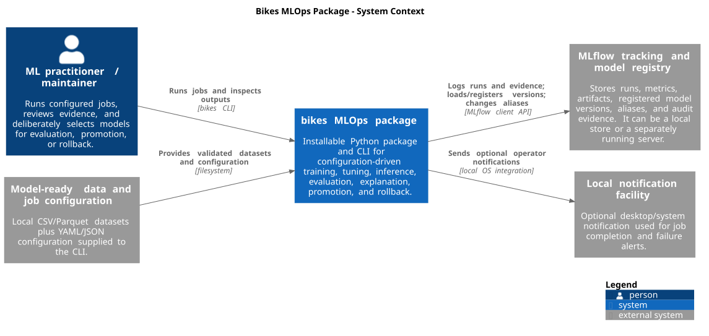
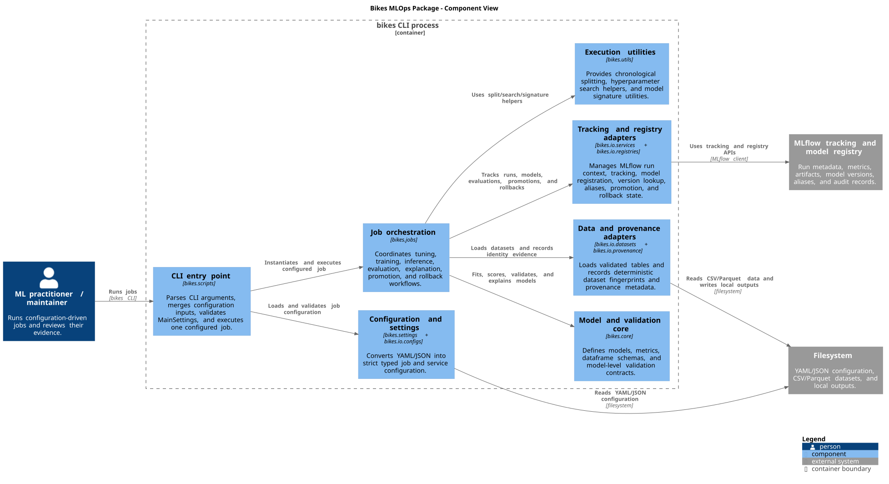

# Architecture

The `bikes` project is primarily an installable Python package and CLI, not a distributed service platform. Architecture documentation therefore focuses on the package boundary, the internal components that own execution responsibilities, and the external stateful systems the package uses.

The existing Mermaid diagrams in `README.md` remain the source for workflow-specific questions such as training/evaluation order and promotion/rollback decisions. The views here answer different questions: what the system is, what sits outside it, and how the package is internally divided.

## System context

Source: [`architecture/context.puml`](architecture/context.puml)

The primary user is an ML practitioner or maintainer running configuration-driven jobs through the `bikes` CLI. Local CSV/Parquet datasets and YAML/JSON configuration are inputs. MLflow is the main external stateful dependency: the package uses its tracking and registry APIs for runs, artifacts, model versions, aliases, promotion state, rollback state, and audit evidence.

The repository supports two MLflow modes. By default, `MlflowService` points tracking and registry URIs at `./mlruns`, so MLflow state is local to the execution environment. The committed Compose file provides a separately running MLflow server on port 5000, but that server path is not yet covered by the end-to-end package-container validation.

The Docker image does not create a new application service boundary. It is another execution environment for the same `bikes` package and CLI. Its default command is `bikes --help`, and CI uses the image to exercise the package lifecycle with networking disabled.

## Component view

Source: [`architecture/components.puml`](architecture/components.puml)

The package is divided by execution responsibility rather than by deployment boundary:

| Component | Responsibility | Main implementation |
| --- | --- | --- |
| CLI entry point | Parse command-line input, merge configuration, validate settings, execute one configured job | `src/bikes/scripts.py` |
| Configuration and settings | Convert YAML/JSON input into strict typed settings and job/service objects | `src/bikes/settings.py`, `src/bikes/io/configs.py` |
| Job orchestration | Coordinate tuning, training, inference, evaluation, explanation, promotion, and rollback | `src/bikes/jobs/` |
| Model and validation core | Models, metrics, schemas, alignment and input contracts | `src/bikes/core/` |
| Data and provenance adapters | Dataset IO, model-ready validation, deterministic fingerprints and provenance metadata | `src/bikes/io/datasets.py`, `src/bikes/io/provenance.py` |
| Tracking and registry adapters | MLflow run context, tracking, model registration, version resolution, aliases and registry state | `src/bikes/io/services.py`, `src/bikes/io/registries.py` |
| Execution utilities | Chronological splitting, hyperparameter search helpers and model signatures | `src/bikes/utils/` |

The important boundary is that `jobs/` orchestrates work but does not itself own persistent state. Data identity is handled through IO/provenance components, while MLflow-specific persistence and registry interactions live behind the IO service and registry adapters.

## Runtime forms

The same package currently runs in three forms:

1. directly from the development environment through `uv run bikes ...`;
2. from an installed wheel in an isolated runtime environment;
3. from the package Docker image.

Those are packaging and execution variants, not separate application architectures. All three execute the same CLI and job layer.

The separate Compose MLflow service is an external tracking/registry process. A future HTTP serving layer, if implemented, would be a genuinely new runtime boundary and should get its own container and sequence views at that point rather than being drawn now as aspirational architecture.

## Existing workflow views

The README already contains Mermaid views for two execution questions and they remain useful:

- training plus reference-checked evaluation data flow;
- promotion plus rollback decision flow.

Those diagrams describe ordered job logic. The C4 views here describe system and component boundaries. Keeping both avoids forcing one notation to answer unrelated questions.

## Deliberate omissions

This architecture does not draw an HTTP serving process because none exists in the current implementation. It also does not depict the Compose MLflow server as a proven production topology: the roadmap explicitly keeps server readiness, durable artifact operations, restart persistence, and HTTP serving as future work.

Likewise, notebooks are treated as historical exploratory material rather than production components, consistent with the repository's current documentation.

## Sources and rendering

PlantUML sources are kept under `documentation/architecture/`. Rendered SVGs are committed under `documentation/architecture/rendered/` so GitHub readers can see the diagrams without installing PlantUML or downloading CI artifacts.

The `.puml` files are the editable source of truth. CI should regenerate them with a pinned PlantUML version and Graphviz, reject diagnostic/error SVGs, and fail if committed SVGs drift from their sources.
